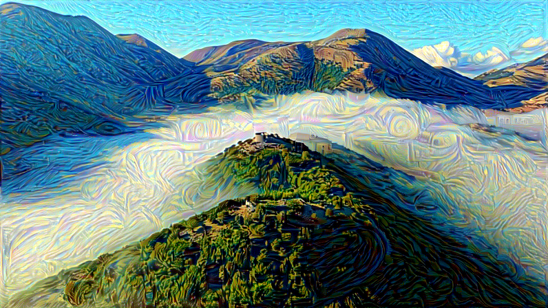

# Neural Style Transfer
This repository contains an implementation of the Neural Style Transfer (NST) algorithm using PyTorch. Neural Style Transfer is a fascinating technique that applies the artistic style of one image to the content of another. I have been intrigued by this technique for some time, but had not taken the time yet to dive a bit deeper. So for this sideproject, I dived into this world by basing myself on the paper A Neural Algorithm of Artistic Style by Leon A. Gatys, Alexander S. Ecker, and Matthias Bethge and implementing the algorithm for myself. Right now only in a notebook, but the goal is to also put this into a small demo application.

## How it works
Neural Style Transfer relies on convolutional neural networks (CNNs) to optimize an output image that maintains the content of a source image while incorporating the style of another image. This is achieved through iterative optimization, where the goal is to minimize a loss function that balances content and style reconstruction.

Content Loss: Ensures that the generated image retains the key features and structure of the content image.

Style Loss: Encourages the generated image to capture the textures and patterns of the style image.

Total Variation Loss (optional, I left this one out): Helps smooth the generated image, reducing noise and enhancing visual quality.

The optimization process is performed using gradient descent, iteratively updating the generated image to reduce the total loss.

### An example
Let's say you made a nice landscape picture while traveling and are wondering what it would look like if Bob Ross had painted this landscape. You take this picture and an image of a landscape painting by Bob Ross, and you let the algorithm go to work. Since you start from the content image, the content loss will rise a bit before converging. The style loss will start quite high and decrease until converging. At this point where the two losses converge, the process has found a balance between the content and style loss. By putting weights on these losses, you get some control over the generated image.

So, for my case I took a nice drone picture in Crete and then use a painting from Bob Ross to transfer the style.


The loss curves look like the following, you can see the convergence of both the content and style loss forming the generated image:


### Some more examples
We can apply the style of Starry Night on the same content image.


Or we can make it into an oil painting.


We can also take other content images and apply whatever style we want.


## Demo App
To make playing around with neural style transfer a bit more straightforward, I created a small demo application using Gradio. It allows you to select a content and style image, as well as the hyperparameters for the generation process. When an image is generated, the app shows both the generated image and the loss curves of the generation process itself.


## Requirements 
- Python 3.11.10
- PyTorch 2.5.1 (+ TorchVision)
- Matplotlib (for plotting images and training curves in the notebook)
- tqdm   
- CUDA 2.4 (to make sure that the generation of an image doesn't last a couple of centuries :), it's advisable to use a GPU) 
- JupyterLab (or similar for running the notebook)
- Gradio (for running the demo app)

## Usage
To simplify the installation of dependencies, an environment.yaml file is provided. This file should work both Windows and Linux systems. You can create a conda environment by running:
```
conda env create -f environment.yaml
conda activate nst
```
This will ensure that all necessary packages and dependencies are correctly installed. However, be aware that this does not install the right CUDA drivers.
If there would be an issue when importing torch or torchvision, one possible solution could be to uninstall both torch and torchvision and then install it again with the driver version of the system you are working on.

Then you can simply run the notebook server with ```jupyter-lab``` open the notebook and start playing around.

Or you can start the demo app with ```python demo_app/main.py```


